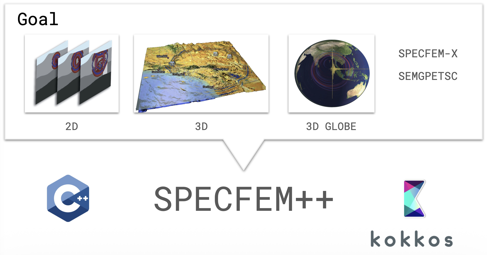
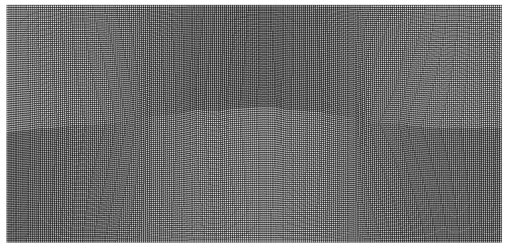
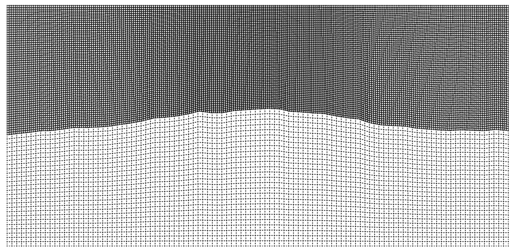
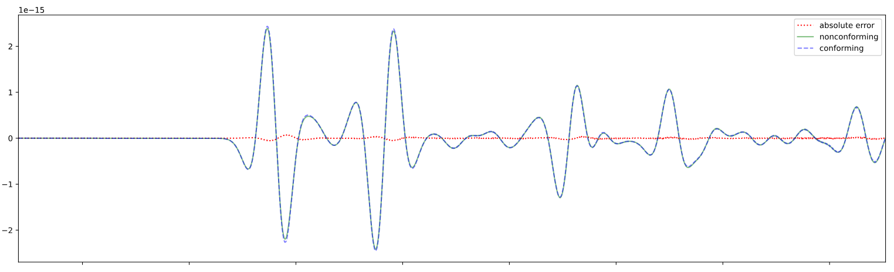
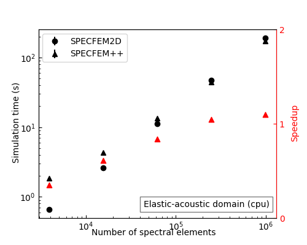
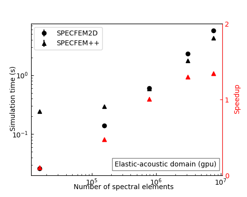
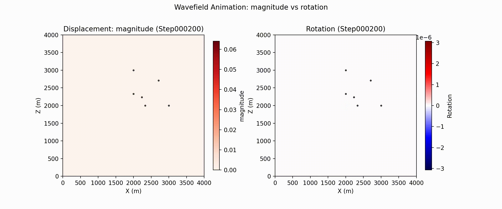

# SPECFEM++ — A Modern, Unified Rewrite of a Seismology Workhorse

SPECFEM has been a cornerstone of computational seismology for over two decades.
The Fortran-based software suite is used for seismic wave propagation simulations and
adjoint tomography, accumulating thousands of citations per year across a broad
user base. But the original codebase grew across three separate repositories
(2D, 3D, and 3D Globe) with substantial redundancy and architecture-specific GPU
kernels, meaning new features rarely made it to all variants.

**SPECFEM++** is the solution: a ground-up rewrite in C++ using
[Kokkos](https://kokkos.org/) for performance portability across CPUs, NVIDIA
GPUs (CUDA), and AMD GPUs (HIP) — all from a single codebase.

## Expanded Physics

One of the primary goals of SPECFEM++ is to make adding new physics
straightforward. The solver now supports **elastic P-SV and SH waves**,
**anisotropic media**, **poroelastic domains**, and **Cosserat media** (which
adds rotational degrees of freedom alongside displacement). Most significantly,
**3D elastic isotropic simulation** is now fully supported, with end-to-end
integration tests confirming sample-by-sample agreement with SPECFEM3D
Cartesian.

For problems with large contrasts in physical properties, **non-conforming mesh
support** via a Discontinuous Galerkin approach allows different element sizes
on either side of an interface. This enables the code to choose larger timesteps
and drastically improve perfomance.

 
<i>Left</i>: Confirming mesh with bathymetry. <i>Center</i>: Non-Conforming Mesh. <i>Right</i>: Associated Non-conforming simulation.
The <i>conforming</i> simulation is part of Pipatprathanporn et al., 2024 (<a href="https://doi.org/10.1093/gji/ggae238">DOI</a>).
 

 Seismograms for conforming and nonconforming DG simulation as well as associated error.

## Performance on Par with — and Beyond — SPECFEM2D

After memory layout optimizations, SPECFEM++ now matches SPECFEM2D on CPU for
elastic and acoustic problems. On GPU, it pulls ahead: for large
elastic-acoustic domains (10M+ spectral elements), SPECFEM++ achieves up to **2×
speedup** over SPECFEM2D.

 
Performance comparison between SPECFEM2D Fortran and SPECFEM++ for CPU (<i>left</i>) and GPU (<i>right</i>).

## Real-World Benchmarks: Marmousi and Cosserat

Two showcases stand out. The **Marmousi model cookbook** runs wave propagation
on a high-resolution CUBIT mesh derived from a classic seismic benchmark, and is
a great stress test of the GPU backend. The **Cosserat media** simulation
illustrates the rotational wavefield alongside displacement — something not
possible in the original SPECFEM.

 
Wave propagation due to an isotropic, explosive source in the complex Marmousi model. Water (acoustic) layer on top and a complex, solid layer below with Stacey Boundary conditions.
 
Wave propagation in a homogeneous Cosserat medium with Stacey boundary conditions on all sides. <i>Left</i>: Magnitude of the displacement component. <i>Right</i>: Rotational (spin) component.

## Tooling and Documentation

**Nightly benchmarks** run automatically via Jenkins on Intel Gold CPUs and
NVIDIA H100 GPUs, with results on a live [review
dashboard](https://tigress-web.princeton.edu/~TROMP/specfempp-review-panel/).
The API documentation now includes the actual implemented equations, and
cookbooks cover everything from basic homogeneous media to non-conforming
fluid-solid interfaces. **Python bindings** allow scripting and automation via
`pip install`.

## What's Next

Active development is focused on MPI support, attenuation, and acoustic-elastic
coupling — the remaining pieces needed for large-scale parallel 3D production
runs.

SPECFEM++ is a community project with monthly developer meetings (first
Wednesday of each month, 12:00 PM Eastern [sign up
here](https://github.com/orgs/SPECFEM/discussions/1553)). Documentation is at
[specfem2d-kokkos.readthedocs.io](https://specfem2d-kokkos.readthedocs.io/en/stable/index.html)
and the code is on [GitHub](https://github.com/PrincetonUniversity/SPECFEMPP).